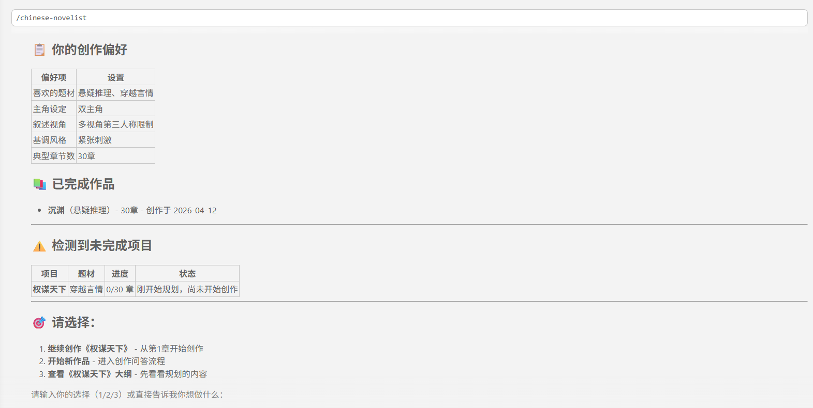
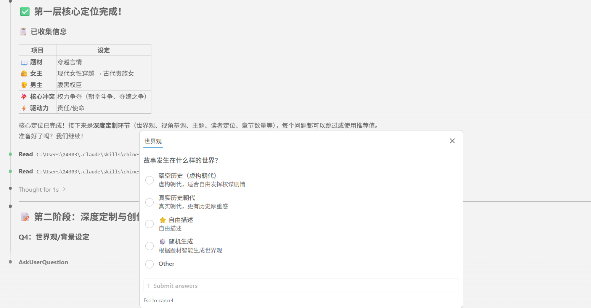
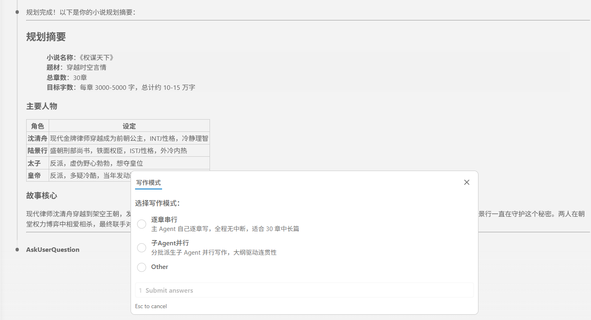
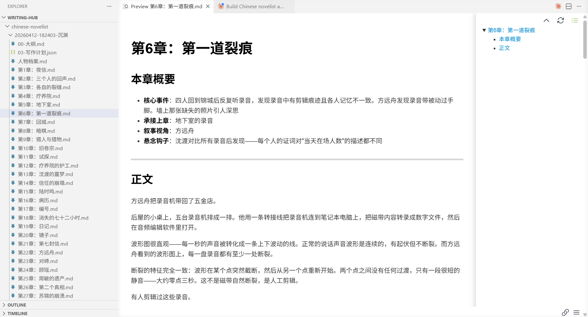

<div align="center">

# 🎭 chinese-novelist skill V2.0

### 资深职业中文网络小说专职作者

[](https://github.com/PenglongHuang/chinese-novelist-skill/releases/tag/v2.0)
[](https://claude.com/claude-code)
[](LICENSE)

> **V2.0 重构升级**：资深作者定位 + 专属创作控制台 + 五类角色体系 + 四大进阶创作系统 + 文风强制去AI化

</div>


## ✨ 核心能力

- **资深作者定位** - 拒绝AI流水线模板，真人手写文风，自然流畅有烟火气
- **专属控制台** - 每次创作输出标准化V2.0控制台，无废话无客套
- **五类角色体系** - 主角/重要角色/次要角色/重要反派/次要反派分层创作
- **四大进阶系统** - 全局时间线 / 刀子伏笔布局 / 进阶条件推动 / 专属成长体系树
- **文风强制去AI** - 杜绝AI通病，口语自然，细节落地，节奏张弛有度
- **全流程闭环** - 世界观搭建 → 人设 → 大纲 → 连载 → 伏笔回收 → 结局

## 🚀 快速开始

输入指令：`使用 chinese-novelist 帮我写一部小说`

首次创作弹出控制台：

```
===== 小说创作控制台 V2.0 =====
创作状态：已激活全流程创作模式
文风模式：真人写实｜无AI模板｜沉浸式叙事
输出规则：细节落地｜节奏可控｜伏笔闭环｜口语自然
当前执行：全书框架初始化+人设世界观搭建
进度同步：待初始化
==============================
```

## 🧠 创作记忆

每次创作后，Skill 会自动学习你的偏好：喜欢的题材类型、叙事风格、章节数量倾向、文字密度等。下次使用时，直接应用你的习惯，省去重复问答。

<p align="center">
  
</p>

## 📊 创作流程

```
用户 → ┌─────────────┐    ┌──────────────────────┐    ┌──────────────┐
       │ Phase 0     │ →  │ Phase 1              │ →  │ Phase 2      │
       │ 初始化      │    │ 三层递进式问答        │    │ 规划 + 确认  │
       │ ·输出控制台 │    │ L1: 核心定位 (必答)   │    │ ·五类人物    │
       │ ·加载偏好   │    │ L2: 深度定制 (可选)   │    │ ·四大体系大纲│
       │ ·检测中断   │    │ L3: 标题生成           │    │ ·写作计划JSON│
       └─────────────┘    └──────────────────────┘    └──────┬───────┘
                                                             ↓
                                             ┌───────────────────────────┐
                                             │ Phase 2.5 写作模式选择     │
                                             │ 串行 / 子Agent并行 / Teams │
                                             └─────────┬─────────────────┘
                                                       ↓
       ┌──────────────────────────────────────────────────────────────┐
       │ Phase 3 疯狂创作（全自动，无需确认）                         │
       │ 逐章：衔接检查→撰写(3000-5000字)→去AI润色→伏笔/时间线更新   │
       └──────────────────────────────────────────────────────────────┘
                             ↓
       ┌──────────────────────────────────────────────────────────────┐
       │ Phase 4 自动校验与修复（全自动）                             │
       │ 字数+伏笔+时间线+人设+文风检查 → 不合格自动重写（最多3轮）  │
       └──────────────────────────────────────────────────────────────┘
                             ↓
                        ✅ 全稿完成
```

### 输出禁忌（绝对禁止）

1. 禁止AI模板化开篇（天下太平、风云变幻等套话）
2. 禁止大段环境铺垫无剧情无人物无冲突的水文
3. 禁止台词脱离人设，全员语气一致
4. 禁止强行升华、强行煽情、强行制造冲突
5. 禁止"此刻、见状、随即、不由得"等AI高频虚词
6. 禁止解释剧情、点评人物、剧透后续
7. 禁止机械分段、重复句式、同质化描写

## 🖼️ 使用过程

<table>
  <tr>
    <td align="center"><b>Phase 1 — 交互问答</b></td>
    <td align="center"><b>Phase 2 — 规划确认</b></td>
  </tr>
  <tr>
    <td></td>
    <td></td>
  </tr>
  <tr>
    <td align="center"><b>Phase 3 — 疯狂创作</b></td>
    <td align="center"><b>Phase 4 — 完稿输出</b></td>
  </tr>
  <tr>
    <td></td>
    <td></td>
  </tr>
</table>

## 📖 输出样例

```
chinese-novelist/
├── user-preferences.json              # 用户偏好（跨项目共享）
└── 20260412-143000-午夜列车/
    ├── 00-人物档案.md                  # 五类角色分层档案
    ├── 01-大纲.md                      # 四大进阶体系集成大纲
    ├── 02-写作计划.json                # 机器可读的写作计划
    ├── 第01章-最后一班列车.md
    ├── 第02章-消失的乘客.md
    └── ...
```

## 🎯 核心法则

| 法则 | 说明 |
|-----|------|
| **真人手写文风** | 自然口语化、细节具象化、节奏张弛有度、视角统一、伏笔隐性铺垫 |
| **展示而非讲述** | 用动作和对话表现，不要直接陈述 |
| **冲突驱动剧情** | 每章必须有冲突或转折 |
| **悬念承上启下** | 每章结尾必须留下钩子 |
| **章节无缝衔接** | 100%精准承接前文，不遗忘不篡改不重置 |

## 🛠️ 安装

将此目录放入 Claude Code 的 skills 目录：

```
~/.claude/skills/chinese-novelist/
```

或通过 Claude Code 技能管理界面安装。

## 📚 内置参考资料

### 流程文档（`references/flows/`）

| 文件 | 内容 |
|------|------|
| `phase0-initialization.md` | Phase 0：初始化 + 控制台输出 |
| `phase1-layer1-core.md` | Phase 1 Layer 1：核心定位问答（Q1-Q3） |
| `phase1-layer2-customize.md` | Phase 1 Layer 2：深度定制问答（Q4-Q8） |
| `phase2-planning.md` | Phase 2：五类角色 + 四大体系规划 |
| `phase3-writing.md` | Phase 3：疯狂创作 + 章节衔接强制标准 |
| `phase4-validation.md` | Phase 4：校验（含伏笔/时间线/人设/文风） |
| `shared-infrastructure.md` | 共享机制（偏好系统、黄金法则、字数脚本） |

### 写作指南（`references/guides/`）

| 文件 | 内容 |
|------|------|
| `chapter-guide.md` | 章节写作指南（含章节衔接强制标准 + 去AI增强清除） |
| `hook-techniques.md` | 悬念设置技巧（13 种结尾钩子类型） |
| `character-building.md` | 五类角色分层塑造技法 |
| `dialogue-writing.md` | 对话写作规范 |
| `plot-structures.md` | 情节结构模板 |
| `content-expansion.md` | 内容扩充技巧 |
| `outline-template.md` | 大纲模板（四大进阶体系集成） |
| `character-template.md` | 五类角色差异化档案模板 |
| `chapter-template.md` | 章节文件模板 |

## 🔄 版本更新

### V2.0 核心升级

- **资深作者定位**：资深职业中文网络小说专职作者，真人手写文风
- **专属控制台**：标准化V2.0控制台输出，无废话无客套
- **五类角色体系**：主角/重要角色/次要角色/重要反派/次要反派
- **四大进阶创作系统**：全局时间线 / 刀子伏笔布局 / 进阶条件推动 / 专属成长体系树
- **章节衔接强制标准**：100%精准承接前文，柔化过渡
- **文风去AI增强**：输出禁忌 + 高频废词清除 + 句式多样性检查
- **增强校验**：伏笔回收完整性 + 时间线自洽 + 人设一致性 + 文风质量

## ⚖️ 许可

MIT
